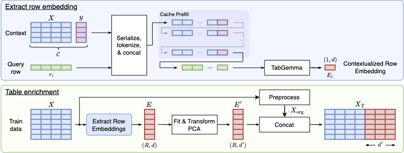

# CASE: Context-Aware Semantic Embeddings
Inference code described in the paper ["Enhancing Tabular Learners with
Context-Aware Semantic Embeddings"](TODO).

## Abstract
While modern tabular learners excel at capturing statistical patterns, they frequently
operate in a semantic vacuum, treating textual features as discrete symbols, ignoringing the rich semantics inherent in feature names or cell entries. We propose
CASE (Context-Aware Semantic Embeddings), a novel framework that bridges the
gap between the semantic understanding of Large Language Models (LLMs) and
the statistical capabilities of tabular learners. Unlike existing methods that embed
rows in isolation, CASE utilizes a contextualization strategy: we pre-fill the KV
cache of a custom-trained Gemma 3-based Tabular Language Model with a repre-
sentative sample of rows to establish a persistent anchor of the dataset’s semantics.
This ensures that generated row embeddings are dynamically contextualized, resolv-
ing semantic ambiguities and anchoring representations in domain-specific context.
Our experiments across several benchmarks (CARTE, TextTab, and TabArena)
demonstrate that CASE significantly improve performance of tabular learners –
particularly in low-data regimes and on semantically rich datasets – setting a new
state of the art when combined with recent tabular in-context learners.



## Quickstart & Example

`case` provides a familiar, `scikit-learn`-compatible transformer interface to extract context-aware semantic embeddings from tabular features, allowing downstream tabular learners to leverage LLM world knowledge.

```python
import numpy as np
import pandas as pd
from tabicl import TabICLRegressor
from case.embedding import CaseTransformer

# --- Training Set ---
# Contains a mix of messy text, semantic job hierarchies, and standard numerical features
X_train = pd.DataFrame({
    "age": [24.0, 30.0, 42.0, 30.0, 31.0, 45.0],
    "job": [
        "Junior Software Engenier", # Contains a typo
        "Senior Data Scientist",    # Base tech track
        "Engineering Manager",      # Management track
        "VP of Product & Strategy",  # Executive tier
        "Sr. Academic Researcher",  # Public/University tier
        "Product Executive",        # Corporate executive tier
    ],
    "years_experience": [1.5, 10.0, 12.0, 10.0, 5.0, 14.0],
    "company_size": ["Startup", "Enterprise", "Mid-market", "Enterprise", "University", "FAANG"],
})

# Target variable: Continuous income baseline
y_train = pd.Series([72000, 130000, 165000, 240000, 85000, 210000], name="income")


# --- Test Set (Out-of-Vocabulary Semantic Shift) ---
# Force identical numerical features, but introduce a clear semantic hierarchy 
# completely unseen during training.
X_test = pd.DataFrame({
    "age": [30.0, 30.0, 30.0],
    "job": [
        "Junior Data Scientist",    # Unseen (implied lower salary band)
        "Data Scientist II",         # Unseen alternative naming (implied mid/senior)
        "Principal Data Scientist",  # Unseen (implied leadership premium)
    ],
    "years_experience": [10.0, 10.0, 10.0],
    "company_size": ["Enterprise", "Enterprise", "Enterprise"],
})

# 1. Initialize CASE to generate context-aware semantic embeddings
case_embedder = CaseTransformer(model_name=<MODEL_NAME>)
X_train_case = case_embedder.fit_transform(X_train, y_train)
X_test_case = case_embedder.transform(X_test)

# 2. Baseline: Fit/Predict without CASE embeddings
reg_baseline = TabICLRegressor()
reg_baseline.fit(X_train, y_train)
predictions_baseline = reg_baseline.predict(X_test)

# 3. Enhanced: Combine raw data with CASE semantic embeddings
X_train_enhanced = pd.concat([X_train, X_train_case], axis=1)
X_test_enhanced = pd.concat([X_test, X_test_case], axis=1)

reg_case = TabICLRegressor()
reg_case.fit(X_train_enhanced, y_train)
predictions_case = reg_case.predict(X_test_enhanced)

print("Predictions w/o CASE:", predictions_baseline)
print("Predictions w/  CASE:", predictions_case)

# Outputs:
# Predictions w/o CASE: [157626.72 157626.72 157626.72]
# Predictions w/  CASE: [101439.39 130765.45 196179.86]
```

This example illustrates a fundamental limitation in traditional tabular learning that **CASE** solves:

* **The Baseline Failure:** Standard tabular architectures lack the semantic grounding to parse raw text features. When faced with identical numerical vectors (`age=30`, `exp=10`), a standalone predictor collapses to the group mean (~$157\text{k}$), completely blind to the fact that a *Junior* and a *Principal* should occupy drastically different salary bands.
* **The CASE Advantage:** By projecting categorical and textual features into a structured, context-aware embedding space, CASE explicitly captures domain-specific hierarchies and lexical variations:
  * **Synonym Mapping:** It reasons that `"Data Scientist II"` shares a semantic profile with the training set's `"Senior Data Scientist"`, leading to a highly accurate, generalized prediction (~$130\text{k}$).
  * **Zero-Shot Relational Scaling:** It extracts the relative weight of prefixes like `"Junior"` and `"Principal"` against historical records, scaling the continuous target up or down realistically without ever seeing those exact string labels during training.

## Citations

If you use CASE in your research or want to refer to our work, please cite:
```
#TODO
```

## How to obtain support
[Create an issue](https://github.com/SAP-samples/case/issues) in this repository if you find a bug or have questions about the content.

## Contributing
If you wish to contribute code, offer fixes or improvements, please send a pull request. Due to legal reasons, contributors will be asked to accept a DCO when they create the first pull request to this project. This happens in an automated fashion during the submission process. SAP uses [the standard DCO text of the Linux Foundation](https://developercertificate.org/).

## License
Copyright (c) 2026 SAP SE or an SAP affiliate company. All rights reserved. This project is licensed under the Apache Software License, version 2.0 except as noted otherwise in the [LICENSE](LICENSE) file.
